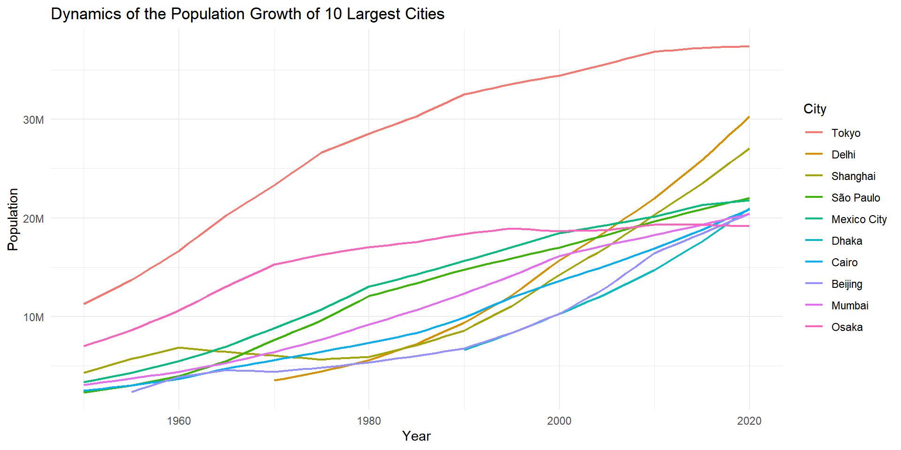

First of all lets load required libraries

``` r
rm(list = ls())

library(tidyverse)
library(here)
library(scales)
library(janitor)
library(ggrepel)

set.seed(42)
theme_set(theme_minimal())
```

# Load data

First, lets load all three datasets and clean them a bit so we can work
with them.

## Cities data

Lets start with the set related to the biggest cities in the world

``` r
cities <- read_csv(here(
  "data", "largest_cities.csv")) 
```

    ## Rows: 55 Columns: 90
    ## -- Column specification --------------------------------------------------------
    ## Delimiter: ","
    ## chr  (3): Country, City, Countries' Flags
    ## dbl (86): 1950, 1951, 1952, 1953, 1954, 1955, 1956, 1957, 1958, 1959, 1960, ...
    ## lgl  (1): From 1950 - 2035
    ## 
    ## i Use `spec()` to retrieve the full column specification for this data.
    ## i Specify the column types or set `show_col_types = FALSE` to quiet this message.

``` r
cities |> glimpse()
```

    ## Rows: 55
    ## Columns: 90
    ## $ Country            <chr> "USA", "Japan", "UK", "Japan", "France", "Russia", ~
    ## $ City               <chr> "New York", "Tokyo", "London", "Osaka", "Paris", "M~
    ## $ `Countries' Flags` <chr> "https://www.countryflags.io/us/flat/64.png", "http~
    ## $ `From 1950 - 2035` <lgl> NA, NA, NA, NA, NA, NA, NA, NA, NA, NA, NA, NA, NA,~
    ## $ `1950`             <dbl> 12338471, 11274641, 8360847, 7005284, 6283018, 5356~
    ## $ `1951`             <dbl> 12514649, 11762249, 8344259, 7328822, 6385702, 5434~
    ## $ `1952`             <dbl> 12690827, 12249856, 8327671, 7652361, 6488386, 5513~
    ## $ `1953`             <dbl> 12867006, 12737464, 8311084, 7975899, 6591069, 5591~
    ## $ `1954`             <dbl> 13043184, 13225071, 8294496, 8299438, 6693753, 5670~
    ## $ `1955`             <dbl> 13219362, 13712679, 8277908, 8622976, 6796437, 5748~
    ## $ `1956`             <dbl> 13408194, 14305907, 8261480, 9021349, 6919297, 5832~
    ## $ `1957`             <dbl> 13597026, 14899136, 8245052, 9419722, 7042156, 5917~
    ## $ `1958`             <dbl> 13785857, 15492364, 8228625, 9818095, 7165016, 6001~
    ## $ `1959`             <dbl> 13974689, 16085593, 8212197, 10216468, 7287875, 608~
    ## $ `1960`             <dbl> 14163521, 16678821, 8195769, 10614841, 7410735, 616~
    ## $ `1961`             <dbl> 14366168, 17399931, 8130316, 11104937, 7499625, 626~
    ## $ `1962`             <dbl> 14568816, 18121041, 8064864, 11595033, 7588515, 635~
    ## $ `1963`             <dbl> 14771463, 18842151, 7999411, 12085130, 7677405, 644~
    ## $ `1964`             <dbl> 14974111, 19563261, 7933959, 12575226, 7766295, 653~
    ## $ `1965`             <dbl> 15176758, 20284371, 7868506, 13065322, 7855185, 662~
    ## $ `1966`             <dbl> 15379642, 20886997, 7796686, 13506560, 7925772, 671~
    ## $ `1967`             <dbl> 15582527, 21489624, 7724866, 13947797, 7996359, 681~
    ## $ `1968`             <dbl> 15785411, 22092250, 7653045, 14389035, 8066947, 691~
    ## $ `1969`             <dbl> 15988296, 22694877, 7581225, 14830272, 8137534, 700~
    ## $ `1970`             <dbl> 16191180, 23297503, 7509405, 15271510, 8208121, 710~
    ## $ `1971`             <dbl> 16128998, 23960949, 7432401, 15476833, 8278066, 720~
    ## $ `1972`             <dbl> 16066816, 24624395, 7355396, 15682156, 8348010, 731~
    ## $ `1973`             <dbl> 16004635, 25287841, 7278392, 15887478, 8417955, 741~
    ## $ `1974`             <dbl> 15942453, 25951287, 7201387, 16092801, 8487899, 751~
    ## $ `1975`             <dbl> 15880271, 26614733, 7124383, 16298124, 8557844, 762~
    ## $ `1976`             <dbl> 15824497, 27001489, 7049746, 16444009, 8580145, 772~
    ## $ `1977`             <dbl> 15768723, 27388245, 6975108, 16589893, 8602446, 782~
    ## $ `1978`             <dbl> 15712949, 27775000, 6900471, 16735778, 8624747, 793~
    ## $ `1979`             <dbl> 15657175, 28161756, 6825833, 16881662, 8647048, 803~
    ## $ `1980`             <dbl> 15601401, 28548512, 6751196, 17027547, 8669349, 813~
    ## $ `1981`             <dbl> 15646478, 28899568, 6749148, 17138564, 8726724, 822~
    ## $ `1982`             <dbl> 15691556, 29250625, 6747099, 17249581, 8784098, 831~
    ## $ `1983`             <dbl> 15736633, 29601681, 6745051, 17360598, 8841473, 840~
    ## $ `1984`             <dbl> 15781711, 29952738, 6743002, 17471615, 8898847, 849~
    ## $ `1985`             <dbl> 15826788, 30303794, 6740954, 17582632, 8956222, 857~
    ## $ `1986`             <dbl> 15878550, 30749036, 6751643, 17743862, 9031043, 866~
    ## $ `1987`             <dbl> 15930312, 31194278, 6762332, 17905092, 9105864, 874~
    ## $ `1988`             <dbl> 15982075, 31639519, 6773022, 18066323, 9180685, 882~
    ## $ `1989`             <dbl> 16033837, 32084761, 6783711, 18227553, 9255506, 890~
    ## $ `1990`             <dbl> 16085599, 32530003, 6794400, 18388783, 9330327, 898~
    ## $ `1991`             <dbl> 16257033, 32741317, 6841422, 18498944, 9366282, 902~
    ## $ `1992`             <dbl> 16428467, 32952631, 6888443, 18609105, 9402237, 907~
    ## $ `1993`             <dbl> 16599902, 33163945, 6935465, 18719266, 9438193, 911~
    ## $ `1994`             <dbl> 16771336, 33375259, 6982486, 18829427, 9474148, 915~
    ## $ `1995`             <dbl> 16942770, 33586573, 7029508, 18939588, 9510103, 920~
    ## $ `1996`             <dbl> 17116890, 33759240, 7078170, 18883675, 9555390, 936~
    ## $ `1997`             <dbl> 17291010, 33931907, 7126832, 18827762, 9600677, 952~
    ## $ `1998`             <dbl> 17465131, 34104574, 7175495, 18771848, 9645964, 968~
    ## $ `1999`             <dbl> 17639251, 34277241, 7224157, 18715935, 9691251, 984~
    ## $ `2000`             <dbl> 17813371, 34449908, 7272819, 18660022, 9736538, 100~
    ## $ `2001`             <dbl> 17868132, 34684235, NA, 18680437, 9807589, 10153904~
    ## $ `2002`             <dbl> 17922892, 34918562, NA, 18700853, 9878641, 10303285~
    ## $ `2003`             <dbl> 17977653, 35152890, NA, 18721268, 9949692, 10452666~
    ## $ `2004`             <dbl> 18032413, 35387217, NA, 18741684, 10020744, 1060204~
    ## $ `2005`             <dbl> 18087174, 35621544, NA, 18762099, 10091795, 1075142~
    ## $ `2006`             <dbl> 18142792, 35869160, NA, 18872208, 10165460, 1089339~
    ## $ `2007`             <dbl> 18198409, 36116777, NA, 18982318, 10239124, 1103536~
    ## $ `2008`             <dbl> 18254027, 36364393, NA, 19092427, 10312789, 1117733~
    ## $ `2009`             <dbl> 18309644, 36612010, NA, 19202537, 10386453, 1131929~
    ## $ `2010`             <dbl> 18365262, 36859626, NA, 19312646, 10460118, 1146126~
    ## $ `2011`             <dbl> 18421735, 36938923, NA, 19311061, 10514795, 1157883~
    ## $ `2012`             <dbl> 18478208, 37018219, NA, 19309476, 10569472, 1169641~
    ## $ `2013`             <dbl> 18534680, 37097516, NA, 19307892, 10624148, 1181398~
    ## $ `2014`             <dbl> 18591153, 37176812, NA, 19306307, 10678825, 1193156~
    ## $ `2015`             <dbl> 18647626, 37256109, NA, 19304722, 10733502, 1204913~
    ## $ `2016`             <dbl> 18678811, 37283513, NA, 19276846, 10790248, 1214689~
    ## $ `2017`             <dbl> 18709996, 37310917, NA, 19248969, 10846993, 1224466~
    ## $ `2018`             <dbl> 18741182, 37338321, NA, 19221093, 10903739, 1234242~
    ## $ `2019`             <dbl> 18772367, 37365725, NA, 19193216, 10960484, 1244019~
    ## $ `2020`             <dbl> 18803552, 37393129, NA, 19165340, 11017230, 1253795~
    ## $ `2021`             <dbl> 18873646, 37321744, NA, 19116598, NA, 12577834, 152~
    ## $ `2022`             <dbl> 18943741, 37250359, NA, 19067857, NA, 12617715, 153~
    ## $ `2023`             <dbl> 19013835, 37178974, NA, 19019115, NA, 12657595, 155~
    ## $ `2024`             <dbl> 19083930, 37107589, NA, 18970374, NA, 12697476, 156~
    ## $ `2025`             <dbl> 19154024, 37036204, NA, 18921632, NA, 12737356, 157~
    ## $ `2026`             <dbl> 19314740, 36943723, NA, 18868917, NA, 12749027, 158~
    ## $ `2027`             <dbl> 19475456, 36851242, NA, 18816201, NA, 12760698, 160~
    ## $ `2028`             <dbl> 19636173, 36758761, NA, 18763486, NA, 12772370, 161~
    ## $ `2029`             <dbl> 19796889, 36666280, NA, 18710770, NA, 12784041, 163~
    ## $ `2030`             <dbl> 19957605, 36573799, NA, 18658055, NA, 12795712, 164~
    ## $ `2031`             <dbl> 20129518, 36461845, NA, 18595566, NA, NA, 16590440,~
    ## $ `2032`             <dbl> 20301431, 36349891, NA, 18533077, NA, NA, 16724765,~
    ## $ `2033`             <dbl> 20473344, 36237938, NA, 18470589, NA, NA, 16859091,~
    ## $ `2034`             <dbl> 20645257, 36125984, NA, 18408100, NA, NA, 16993416,~
    ## $ `2035`             <dbl> 20817170, 36014030, NA, 18345611, NA, NA, 17127741,~

Definitely some transformation needed

``` r
cities <-  cities |> 
  # we don't need these columns
  select(-`Countries' Flags`,
         -`From 1950 - 2035`) |>  
  # convert to tidy format
  pivot_longer(-c(Country, City), 
               names_to = "Year",
               values_to = "Population") |> 
  # set appropriate data type 
  mutate(Year       = as.integer(Year),
         Population = as.integer(Population)) 

head(cities)
```

    ## # A tibble: 6 x 4
    ##   Country City      Year Population
    ##   <chr>   <chr>    <int>      <int>
    ## 1 USA     New York  1950   12338471
    ## 2 USA     New York  1951   12514649
    ## 3 USA     New York  1952   12690827
    ## 4 USA     New York  1953   12867006
    ## 5 USA     New York  1954   13043184
    ## 6 USA     New York  1955   13219362

Data is loaded and tidy, lets try to do some summary statistic to better
understand the data

``` r
cities |> 
  group_by(Country, City) |> 
  summarise(na = sum(is.na(Population))) |> 
  arrange(desc(na))
```

    ## `summarise()` has grouped output by 'Country'. You can override using the
    ## `.groups` argument.

    ## # A tibble: 55 x 3
    ## # Groups:   Country [28]
    ##    Country  City             na
    ##    <chr>    <chr>         <int>
    ##  1 Angola   Luanda           85
    ##  2 Italy    Milan            85
    ##  3 USA      San Francisco    85
    ##  4 Colombia Bogotá           80
    ##  5 India    Hyderabad        80
    ##  6 Spain    Madrid           80
    ##  7 UK       Birmingham       80
    ##  8 UK       Manchester       80
    ##  9 Italy    Rome             75
    ## 10 China    Shenyang         70
    ## # ... with 45 more rows

For some Cities there are a lot of missing values we need to do
something with them.

``` r
cities |> 
  filter(City == "San Francisco")  
```

    ## # A tibble: 86 x 4
    ##    Country City           Year Population
    ##    <chr>   <chr>         <int>      <int>
    ##  1 USA     San Francisco  1950    1855207
    ##  2 USA     San Francisco  1951         NA
    ##  3 USA     San Francisco  1952         NA
    ##  4 USA     San Francisco  1953         NA
    ##  5 USA     San Francisco  1954         NA
    ##  6 USA     San Francisco  1955         NA
    ##  7 USA     San Francisco  1956         NA
    ##  8 USA     San Francisco  1957         NA
    ##  9 USA     San Francisco  1958         NA
    ## 10 USA     San Francisco  1959         NA
    ## # ... with 76 more rows

For example San Francisco. There is basically only one value for this
city. Also, for very few cities there are data for \> 2022 year, which I
think is not reliable. So I will filter out those observations.

``` r
cities <- cities |> 
  filter(Year <= 2020)
```

``` r
cities |> 
  group_by(Country, City) |> 
  summarise(na = sum(is.na(Population))) |> 
  arrange(desc(na))
```

    ## `summarise()` has grouped output by 'Country'. You can override using the
    ## `.groups` argument.

    ## # A tibble: 55 x 3
    ## # Groups:   Country [28]
    ##    Country  City             na
    ##    <chr>    <chr>         <int>
    ##  1 Angola   Luanda           71
    ##  2 India    Hyderabad        71
    ##  3 Colombia Bogotá           70
    ##  4 Italy    Milan            70
    ##  5 USA      San Francisco    70
    ##  6 India    Madras           69
    ##  7 India    Bangalore        65
    ##  8 Pakistan Lahore           65
    ##  9 Spain    Madrid           65
    ## 10 UK       Birmingham       65
    ## # ... with 45 more rows

So far I don’t know how I am going to use this data, so I will not do
anything with those missing values.

## Biggest 10 Cities

Lets plot the population growth data for the 10 biggest cities for based
for 2020 year

``` r
top_10_cities <- cities |> 
  filter(Year == 2020) |> 
  arrange(desc(Population)) |> 
  head(10) |> 
  pull(City)
```

``` r
cities |> 
  # select biggest cities
  filter(City %in% top_10_cities) |> 
  # set Cities as factor to plot colours properly
  mutate(City = factor(City, levels = top_10_cities)) |> 
  
  
  # plot
  ggplot(aes(x = Year, y = Population, 
             color = City)) + 
  geom_line(size = 0.75) +
  scale_y_continuous(labels = label_number_si()) +
  labs(title = "Dynamics of the Pupulation Growth of 10 Largest Cities")
```

    ## Warning: `label_number_si()` was deprecated in scales 1.2.0.
    ## Please use the `scale_cut` argument of `label_number()` instead.
    ## This warning is displayed once every 8 hours.
    ## Call `lifecycle::last_lifecycle_warnings()` to see where this warning was generated.

    ## Warning: Removed 65 row(s) containing missing values (geom_path).



The numbers are actually suspiciously high. I’ve checked on
[wikipedia](https://en.wikipedia.org/wiki/Tokyo#Demographics) there was
only 14 million of people living in Tokyo in 2020, but not \> 30 million
like on the graph.

On the dataset documentation it is also not written about the nature of
the data.

## buildings data

``` r
bild <- read.csv(here("data", "tallest_buildings.csv")) |>
  clean_names()


bild |> glimpse()
```

    ## Rows: 100
    ## Columns: 8
    ## $ rank       <int> 1, 2, 3, 4, 5, 6, 7, 7, 9, 10, 11, 12, 13, 14, 15, 16, 17, ~
    ## $ name       <chr> "Burj Khalifa", "Shanghai Tower", "Makkah Royal Clock Tower~
    ## $ city       <chr> "Dubai", "Shanghai", "Mecca", "Shenzhen", "Seoul", "New Yor~
    ## $ completion <int> 2010, 2015, 2012, 2017, 2017, 2014, 2016, 2019, 2018, 2004,~
    ## $ height     <chr> "828 m\n/\n2,717 ft", "632 m\n/\n2,073 ft", "601 m\n/\n1,97~
    ## $ floors     <chr> "163", "128", "120", "115", "123", "94", "111", "97", "109"~
    ## $ material   <chr> "steel/concrete", "composite", "steel/concrete", "composite~
    ## $ `function` <chr> "office / residential / hotel", "hotel / office", "hotel / ~

I will have to do some data preparation

``` r
bild <- bild |> 
  # split height into two columns ft and m 
  separate(height, into = c("height_m", "height_ft"), sep = "\n/\n") |> 
  
  # extract number and convert to decimal 
  mutate(height_m =  str_extract(height_m,
                                 # some digits maybe dot and one digit
                                 regex("^[:digit:]*[:punct:]?[:digit:]")),
         height_m = as.double(height_m),
         
         height_ft = str_extract(height_ft, 
                                 # maybe digit maybe dot and some digits
                                 regex("^[:digit:]?[:punct:]?[:digit:]*")),
         height_ft = str_replace(height_ft, ",", "."),
         height_ft = as.double(height_ft), 
         
         # extract materials 
         material = str_extract(material, regex("[:lower:]*"))
         ) |> 
  rename(year = completion) |> 
  
  # drop one duplicated value
  filter(!duplicated(rank))


bild |> head()
```

    ##   rank                     name          city year height_m height_ft floors
    ## 1    1             Burj Khalifa         Dubai 2010    828.0     2.717    163
    ## 2    2           Shanghai Tower      Shanghai 2015    632.0     2.073    128
    ## 3    3 Makkah Royal Clock Tower         Mecca 2012    601.0     1.972    120
    ## 4    4   Ping An Finance Center      Shenzhen 2017    599.1     1.965    115
    ## 5    5        Lotte World Tower         Seoul 2017    554.5     1.819    123
    ## 6    6   One World Trade Center New York City 2014    541.3     1.776     94
    ##    material                              function
    ## 1     steel          office / residential / hotel
    ## 2 composite                        hotel / office
    ## 3     steel          hotel / residential / retail
    ## 4 composite                                office
    ## 5 composite hotel / residential / office / retail
    ## 6 composite                                office

### Relationship between year highest building

``` r
bild |> 
  arrange(year) |> 
  mutate(highest_building = cummax(height_m)) |> 
  
  # Plot
  ggplot(aes(x = year, y = height_m)) +
  geom_point(aes(color = material), size = 3, alpha = 0.5) +
  geom_line(aes(x = year, y = highest_building),
            alpha = 0.3, linetype = "dashed") +
  
  # add text 
  geom_text_repel(
    data = subset(bild, rank %in% c(1,10,17,23,49,87)),
      aes(label = name),
      size = 3,
      box.padding = 0.5,
      arrow = arrow(length = unit(0.010, "npc")),
      nudge_x = -2,
      nudge_y = 5,
      color = "grey50"
  ) +
  
  labs(title = "Evolution of the highest buildings",
       y = "Height in meters",
       x = "") 
```


## Load Countries Data

``` r
count <- read.csv(here("data", "countries.csv"), dec = ",") |> 
  clean_names() |> 
  
  # Clean strings vectors from whitespases 
  mutate(country = str_trim(country),
         region = str_trim(region))

glimpse(count)
```

    ## Rows: 227
    ## Columns: 20
    ## $ country                          <chr> "Afghanistan", "Albania", "Algeria", ~
    ## $ region                           <chr> "ASIA (EX. NEAR EAST)", "EASTERN EURO~
    ## $ population                       <int> 31056997, 3581655, 32930091, 57794, 7~
    ## $ area_sq_mi                       <int> 647500, 28748, 2381740, 199, 468, 124~
    ## $ pop_density_per_sq_mi            <dbl> 48.0, 124.6, 13.8, 290.4, 152.1, 9.7,~
    ## $ coastline_coast_area_ratio       <dbl> 0.00, 1.26, 0.04, 58.29, 0.00, 0.13, ~
    ## $ net_migration                    <dbl> 23.06, -4.93, -0.39, -20.71, 6.60, 0.~
    ## $ infant_mortality_per_1000_births <dbl> 163.07, 21.52, 31.00, 9.27, 4.05, 191~
    ## $ gdp_per_capita                   <int> 700, 4500, 6000, 8000, 19000, 1900, 8~
    ## $ literacy                         <dbl> 36.0, 86.5, 70.0, 97.0, 100.0, 42.0, ~
    ## $ phones_per_1000                  <dbl> 3.2, 71.2, 78.1, 259.5, 497.2, 7.8, 4~
    ## $ arable                           <dbl> 12.13, 21.09, 3.22, 10.00, 2.22, 2.41~
    ## $ crops                            <dbl> 0.22, 4.42, 0.25, 15.00, 0.00, 0.24, ~
    ## $ other                            <dbl> 87.65, 74.49, 96.53, 75.00, 97.78, 97~
    ## $ climate                          <dbl> 1.0, 3.0, 1.0, 2.0, 3.0, NA, 2.0, 2.0~
    ## $ birthrate                        <dbl> 46.60, 15.11, 17.14, 22.46, 8.71, 45.~
    ## $ deathrate                        <dbl> 20.34, 5.22, 4.61, 3.27, 6.25, 24.20,~
    ## $ agriculture                      <dbl> 0.380, 0.232, 0.101, NA, NA, 0.096, 0~
    ## $ industry                         <dbl> 0.240, 0.188, 0.600, NA, NA, 0.658, 0~
    ## $ service                          <dbl> 0.380, 0.579, 0.298, NA, NA, 0.246, 0~

Lets explore some data a bit

``` r
count |> 
  summarise(across(everything(), ~ sum(is.na(.)))) |> 
  pivot_longer(cols = everything(),
               names_to = "column",
               values_to = "na_count")
```

    ## # A tibble: 20 x 2
    ##    column                           na_count
    ##    <chr>                               <int>
    ##  1 country                                 0
    ##  2 region                                  0
    ##  3 population                              0
    ##  4 area_sq_mi                              0
    ##  5 pop_density_per_sq_mi                   0
    ##  6 coastline_coast_area_ratio              0
    ##  7 net_migration                           3
    ##  8 infant_mortality_per_1000_births        3
    ##  9 gdp_per_capita                          1
    ## 10 literacy                               18
    ## 11 phones_per_1000                         4
    ## 12 arable                                  2
    ## 13 crops                                   2
    ## 14 other                                   2
    ## 15 climate                                22
    ## 16 birthrate                               3
    ## 17 deathrate                               4
    ## 18 agriculture                            15
    ## 19 industry                               16
    ## 20 service                                15

We have some missing values

``` r
count |> 
  count(region, sort = TRUE)
```

    ##                  region  n
    ## 1    SUB-SAHARAN AFRICA 51
    ## 2   LATIN AMER. & CARIB 45
    ## 3  ASIA (EX. NEAR EAST) 28
    ## 4        WESTERN EUROPE 28
    ## 5               OCEANIA 21
    ## 6             NEAR EAST 16
    ## 7   C.W. OF IND. STATES 12
    ## 8        EASTERN EUROPE 12
    ## 9       NORTHERN AFRICA  6
    ## 10     NORTHERN AMERICA  5
    ## 11              BALTICS  3

``` r
count |> 
  mutate(region = as_factor(region) |> 
           fct_reorder(gdp_per_capita)) |> 

  ggplot(aes(y = gdp_per_capita, x = birthrate)) +
  geom_point(aes(col = region, size = population*2), alpha = 0.5) +

  scale_y_log10(label = dollar_format(accuracy = 1)) +
  geom_smooth(method = "lm", alpha = 0.3) + 
  scale_size(guide = FALSE) +
  
  labs(title = "Relationship between GDP Per Capita and Average Birthrate",
       y = "GDP Per Capita", 
       x = "Birthrate",
       caption = "Size of buble represent population size")
```

    ## `geom_smooth()` using formula 'y ~ x'

    ## Warning: Removed 3 rows containing non-finite values (stat_smooth).

    ## Warning: Removed 3 rows containing missing values (geom_point).

    ## Warning: It is deprecated to specify `guide = FALSE` to remove a guide. Please
    ## use `guide = "none"` instead.


# The grow of population on each continent

To make this plot we would need to join the datasets

``` r
cities |> 
  distinct(Country, City) |> 
  arrange(Country)
```

    ## # A tibble: 55 x 2
    ##    Country    City          
    ##    <chr>      <chr>         
    ##  1 Angola     Luanda        
    ##  2 Argentina  Buenos Aires  
    ##  3 Bangladesh Dhaka         
    ##  4 Brazil     Rio de Janeiro
    ##  5 Brazil     São Paulo     
    ##  6 China      Shanghai      
    ##  7 China      Tianjin       
    ##  8 China      Shenyang      
    ##  9 China      Beijing       
    ## 10 China      Chongqing     
    ## # ... with 45 more rows

``` r
count |> 
  distinct(region, country) |> 
  arrange(country) |> 
  head()
```

    ##          country               region
    ## 1    Afghanistan ASIA (EX. NEAR EAST)
    ## 2        Albania       EASTERN EUROPE
    ## 3        Algeria      NORTHERN AFRICA
    ## 4 American Samoa              OCEANIA
    ## 5        Andorra       WESTERN EUROPE
    ## 6         Angola   SUB-SAHARAN AFRICA

Countries are named differently in the two datasets, to we need to
standardise them for joining.

``` r
library(countrycode)
```

    ## Warning: package 'countrycode' was built under R version 4.1.3

Small helper function

``` r
## Takes country name as input and convert it to set standard country name

standatise_country_name <- function(old_country_name, 
                                    initial_code_scheme = "country.name",
                                    
                                    # ISO English short name
                                    resulting_code_scheme = "iso.name.en") {
  
  new_country_name <- countrycode(sourcevar = old_country_name,
                        origin = initial_code_scheme,
                        destination = resulting_code_scheme,
                        warn = TRUE,
                        nomatch = NULL)
  
  return(new_country_name)
  }
```

``` r
count <- count |> 
  mutate(country_new = standatise_country_name(country,
                                    resulting_code_scheme = "iso3c"))
```

``` r
cities <- cities |> 
  mutate(Country_new = standatise_country_name(Country,
                                    resulting_code_scheme = "iso3c"))
```

Add the information about region to the cities dataset and plot it

``` r
count |> 
  select(region, country_new) |> 
  right_join(cities, by = c("country_new" = "Country_new")) |> 
  
  # Filter out those two regions due to limited observation number
  filter(!region %in% c("NEAR EAST", "SUB-SAHARAN AFRICA")) |> 
  
  
  # plot 
  ggplot(aes(x = Year, y = Population, 
             color = City)) + 
  geom_line(size = 0.75) +
  scale_y_continuous(labels = label_number_si()) +

  facet_wrap(vars(region), nrow  = 2, scales = "free_y") + 
  theme(legend.position = "none")  +
  
  labs(title = "Dynamics of the Cities Pupulation Growth in different Regions of the world", 
       x = "") 
```

    ## Warning: Removed 1596 row(s) containing missing values (geom_path).


The plot would have been more beautiful if we have had more data.

## Tallest building in 5 biggest cities

``` r
cities_with_many_big_buildings <-  bild |> 
  count(city, sort = TRUE) |> 
  filter(n >= 6 ) |> 
  pull(city)

cities_with_many_big_buildings
```

    ## [1] "Dubai"         "New York City" "Shenzhen"

``` r
bild |> 
  #prepare data
  filter(city %in% cities_with_many_big_buildings) |>
  group_by(city) |> 
  mutate(name = fct_reorder(name, height_m)) |> 

  # plot
  ggplot(aes(x = name, y = height_m)) +
  geom_col(fill = "cornflowerblue") + 
  coord_flip() +
  facet_grid(rows = vars(city),  scales = "free_y", space = "free_y") +
  
  # labels
  labs(title = "Highest buildings in the selected cities",
       x = "Building name",
       y = "Height in meters")
```


``` r
sessionInfo()
```

    ## R version 4.1.0 (2021-05-18)
    ## Platform: x86_64-w64-mingw32/x64 (64-bit)
    ## Running under: Windows 10 x64 (build 22000)
    ## 
    ## Matrix products: default
    ## 
    ## locale:
    ## [1] LC_COLLATE=English_United States.1252 
    ## [2] LC_CTYPE=English_United States.1252   
    ## [3] LC_MONETARY=English_United States.1252
    ## [4] LC_NUMERIC=C                          
    ## [5] LC_TIME=English_United States.1252    
    ## 
    ## attached base packages:
    ## [1] stats     graphics  grDevices utils     datasets  methods   base     
    ## 
    ## other attached packages:
    ##  [1] countrycode_1.4.0 ggrepel_0.9.1     janitor_2.1.0     scales_1.2.0     
    ##  [5] here_1.0.1        forcats_0.5.1     stringr_1.4.0     dplyr_1.0.9      
    ##  [9] purrr_0.3.4       readr_2.1.2       tidyr_1.2.0       tibble_3.1.7     
    ## [13] ggplot2_3.3.6     tidyverse_1.3.1  
    ## 
    ## loaded via a namespace (and not attached):
    ##  [1] Rcpp_1.0.8.3     lattice_0.20-45  lubridate_1.8.0  assertthat_0.2.1
    ##  [5] rprojroot_2.0.3  digest_0.6.29    utf8_1.2.2       R6_2.5.1        
    ##  [9] cellranger_1.1.0 backports_1.4.1  reprex_2.0.1     evaluate_0.15   
    ## [13] highr_0.9        httr_1.4.3       pillar_1.7.0     rlang_1.0.2     
    ## [17] readxl_1.4.0     rstudioapi_0.13  Matrix_1.4-0     rmarkdown_2.14  
    ## [21] splines_4.1.0    labeling_0.4.2   bit_4.0.4        munsell_0.5.0   
    ## [25] broom_0.8.0      compiler_4.1.0   modelr_0.1.8     xfun_0.30       
    ## [29] pkgconfig_2.0.3  mgcv_1.8-38      htmltools_0.5.2  tidyselect_1.1.2
    ## [33] fansi_1.0.3      crayon_1.5.1     tzdb_0.3.0       dbplyr_2.1.1    
    ## [37] withr_2.5.0      grid_4.1.0       nlme_3.1-155     jsonlite_1.8.0  
    ## [41] gtable_0.3.0     lifecycle_1.0.1  DBI_1.1.2        magrittr_2.0.3  
    ## [45] cli_3.3.0        stringi_1.7.6    vroom_1.5.7      farver_2.1.0    
    ## [49] fs_1.5.2         snakecase_0.11.0 xml2_1.3.3       ellipsis_0.3.2  
    ## [53] generics_0.1.2   vctrs_0.4.1      tools_4.1.0      bit64_4.0.5     
    ## [57] glue_1.6.2       hms_1.1.1        parallel_4.1.0   fastmap_1.1.0   
    ## [61] yaml_2.3.5       colorspace_2.0-3 rvest_1.0.2      knitr_1.39      
    ## [65] haven_2.5.0
